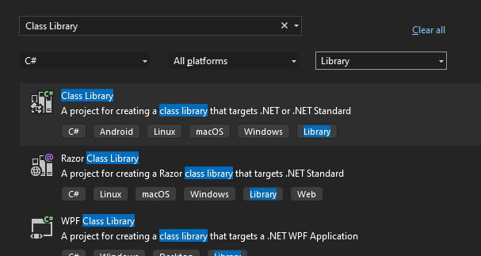
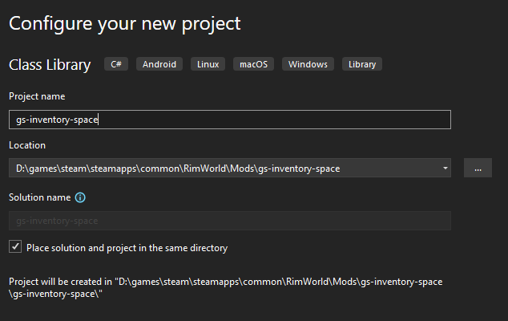
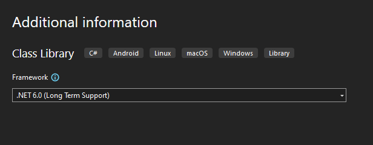
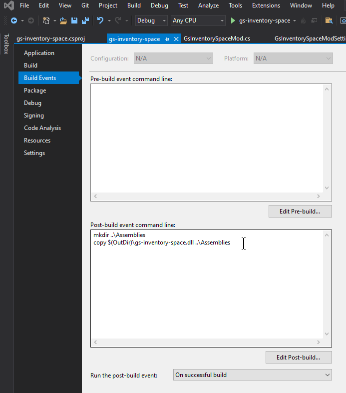
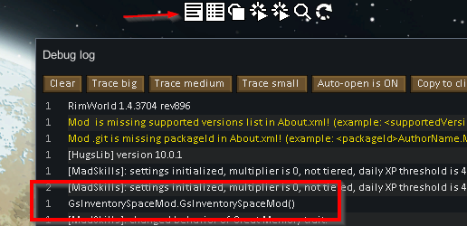
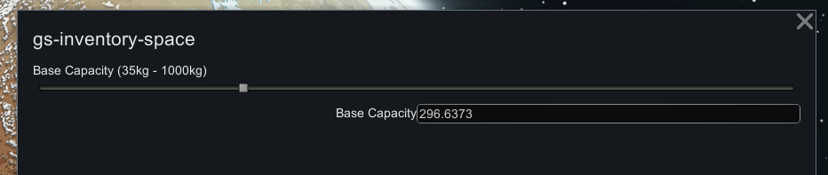
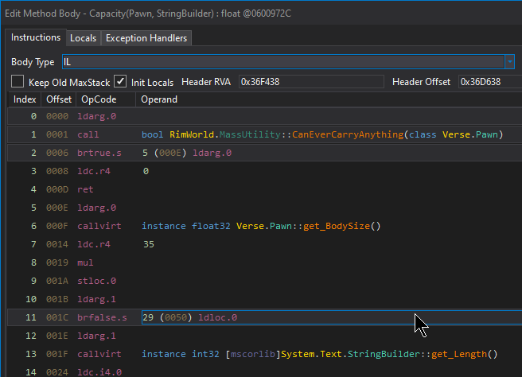

# gs-inventory-space

This mod will allow you to increase your inventory space and caravan carrying capacity for all Pawns.
The value seems to be hard-coded as 35kg times the Pawn's 'BodySize', which is 1.0 for humans.

## Original Code

Using `dnSpy`, I fouidn the code in `RimWorld.MassUtility.Capacity()`:

```cs
// Token: 0x0600972C RID: 38700 RVA: 0x0036F438 File Offset: 0x0036D638
public static float Capacity(Pawn p, StringBuilder explanation = null)
{
	if (!MassUtility.CanEverCarryAnything(p))
	{
		return 0f;
	}
	float num = p.BodySize * 35f;
	if (explanation != null)
	{
		if (explanation.Length > 0)
		{
			explanation.AppendLine();
		}
		explanation.Append("  - " + p.LabelShortCap + ": " + num.ToStringMassOffset());
	}
	return num;
}
```

The important line is:

	float num = p.BodySize * 35f;

The Harmony transpile patch we write will replace this instruction with one that has
a different value.

## Creating Project

First I used Visual Studio 2022 to create a new  'Class Library', selecting 'C#' as
the language and 'Library' as the project type makes it appear at the top of the list. 
It should be 'A project for creatign a class library that targets .NET or .NET Standard'



For configuration, I specified the name, to put the project and solution in the same 
directory for simplicity.   I created a directory in my RimWorld mods folder for
'gs-inventory-space' already and selected that, which means the solution and project will go into
'gs-inventory-space/gs-inventory-space' since it always uses the project or solution name
to create folders.



For the Framework I select '.NET 6.0 (Long Term Support)'.  This is needed to create
the right project type and allow us to use NuGet I guess.



Once the project is created and loaded, right-click on the project and select
'Unload Project'.   That should open the project xml file for editing.  If not, right-click
on the project again and select "Edit Project File".  You should see this:

```xml
<Project Sdk="Microsoft.NET.Sdk">

  <PropertyGroup>
    <TargetFramework>net6.0</TargetFramework>
    <RootNamespace>gs_inventory_space</RootNamespace>
    <ImplicitUsings>enable</ImplicitUsings>
    <Nullable>enable</Nullable>
  </PropertyGroup>

</Project>
```

Change the TargetFramework to `net472` and ImplicitUsings to `disable`, and remove the 'Nullable' setting, it should look like this:

```xml
<Project Sdk="Microsoft.NET.Sdk">

  <PropertyGroup>
    <TargetFramework>net472</TargetFramework>
    <RootNamespace>gs_inventory_space</RootNamespace>
    <ImplicitUsings>disable</ImplicitUsings>
  </PropertyGroup>

</Project>
```

Now save and then right-click on the project and select 'Reload Project'.
Right-click on 'Dependencies' under the project and select 'Manage NuGet packages...'
to open the package manager.   Click on 'Browse' and find and install these:

* Krafs.Rimworld.Ref (1.4.3704)
* Lib.Harmony (2.2.2)

Then I quit visual studio and renamed the folder to 'Source' so the solution file is
`Rimworld/Mods/gs-inventory-space/Source/gs-inventory-space.sln`

Reopening the project, I removed 'Class1' and added two new classes, `GsInventorySpaceModSettings.cs`
which will control the single setting we have to enable updating the base capacity of 35kg:

```cs
using System;
using System.Collections.Generic;
using System.Linq;
using System.Text;
using System.Threading.Tasks;
using Verse;

namespace gs_inventory_space
{
    public class GsInventorySpaceModSettings : ModSettings
    {
        public float BaseCapacity = 35.0f;

        public override void ExposeData()
        {
            Scribe_Values.Look(ref BaseCapacity, "BaseCapacity", 35f);
            base.ExposeData();
        }
    }
}
```

And a class that inherits from 'Verse.Mod' that will contain and control our
settings by overriding base methods.  It accepts an instance of settings
from the game when it is constructed and overrides 'DoSettingsWindowContents'
to draw the controls for editing our setting.

```cs
using UnityEngine;
using Verse;

namespace gs_inventory_space
{
    /// <summary>
    /// See: https://rimworldwiki.com/wiki/Modding_Tutorials/ModSettings
    /// </summary>
    public class GsInventorySpaceMod : Mod
    {
        public GsInventorySpaceModSettings Settings;

        public GsInventorySpaceMod(ModContentPack content) : base(content)
        {
            Log.Message("GsInventorySpaceMod.GsInventorySpaceMod()");
            this.Settings = GetSettings<GsInventorySpaceModSettings>();
        }

        /// <summary>
        /// This is called many times when changing mod settings, possibly after any change is made?
        /// </summary>
        /// <param name="inRect"></param>
        public override void DoSettingsWindowContents(Rect inRect)
        {
            Listing_Standard listingStandard = new Listing_Standard();
            listingStandard.Begin(inRect);
            listingStandard.Label("Base Capacity (35kg - 1000kg)");
            Settings.BaseCapacity = listingStandard.Slider(Settings.BaseCapacity, 35f, 1000f);
            string buffer = $"{Settings.BaseCapacity}";
            listingStandard.TextFieldNumericLabeled<float>("Base Capacity", ref Settings.BaseCapacity, ref buffer, min: 35f, max: 1000f);
            listingStandard.End();
            base.DoSettingsWindowContents(inRect);
        }

        public override string SettingsCategory()
        {
            return "gs-inventory-space";
        }

        public override void WriteSettings()
        {
            Log.Message("GsInventorySpaceMod.WriteSettings()");
            base.WriteSettings();
        }
    }
}
```

The final thing we want to do is copy our dll to the mod 'Assemblies' directory.
I don't want to change the output path directly for two reasons.   There is an
automatic framework subdirectory (i.e. net472) that is hard to get rid of.  Also
we only want our dll and not the 'pdb' file or the Harmony dll since the Harmony
dll should be provided by the Harmony mod.

So instead, right-click on the project and click on 'Properties'.  Select 'Build Events'
on the left and click on 'Edit Post-build...' and enter these lines:

```
mkdir ..\Assemblies
copy $(OutDir)\gs-inventory-space.dll ..\Assemblies
```



For some reason this looked different when I re-opened the project and it didn't allow
for multiple lines.   The project file should look like this though, notice the
`&#xD;&#xA;` for CR/LF in the post build event:

```xml
<Project Sdk="Microsoft.NET.Sdk">

  <PropertyGroup>
    <TargetFramework>net472</TargetFramework>
    <RootNamespace>gs_inventory_space</RootNamespace>
    <ImplicitUsings>disable</ImplicitUsings>
  </PropertyGroup>

  <PropertyGroup Condition="'$(Configuration)|$(Platform)'=='Debug|AnyCPU'">
    <OutputPath></OutputPath>
  </PropertyGroup>

  <ItemGroup>
    <PackageReference Include="Krafs.Rimworld.Ref" Version="1.4.3704" />
    <PackageReference Include="Lib.Harmony" Version="2.2.2" />
  </ItemGroup>

  <Target Name="PostBuild" AfterTargets="PostBuildEvent">
    <Exec Command="mkdir ..\Assemblies&#xD;&#xA;copy $(OutDir)\gs-inventory-space.dll ..\Assemblies" />
  </Target>

</Project>
```

Save everything and build and now you should see 'gs-inventory-space.dll'
in the `Rimworld/Mods/gs-inventory-space/Assemblies` directory.  We want
to ignore that in source control, so add a '.gitignore' file to the Mod directory
and add 'Assemblies' to it.  Also add a standard visual studio '.gitignore'
to the source directory so the binary output there isn't included either.

Finally, we need to add an 'About' folder and an 'About.xml' file under it to
define our mod:

```xml
<?xml version="1.0" encoding="utf-8"?>
<ModMetaData>
  <packageId>Goemaat.GsInventorySpace</packageId>
  <author>Jason Goemaat</author>
  <name>gs-inventory-space</name>
  <description>Allows you to alter the global capacity to allow all pawns to carry more than the default, which is 35kg for colonists with BodySize 1.0</description>
  <supportedVersions>
    <li>1.4</li>
  </supportedVersions>
  <forceLoadBefore>
  </forceLoadBefore>
</ModMetaData>
```

Running Rimworld at this point, you should click on 'Mods' and enable the 'gs-inventory-space' mod, then select save and restart.
After that you can click on the log button and should see the message from our constructor:



Click on 'Options' and 'Mod Options' and select our mod.  You should
see a slider and a text box for editing the value:



## Harmony Patching

Now we need to add a class to apply a Harmony patch.   Since
the value is hard-coded in the `MassUtility.Capacity(...)` method,
we will use 'transpile'.   That will let us replace instructions
inside the actual method.

Create a new class called whatever you want, I chose 'HarmonyPatches.cs'.
Change the class to 'public static' and add a static constructor, then
decorate the class with the `StaticConstructorOnStartup` attribute from
the 'Verse' namespace and add a quick logging message to show it
is working when you rebuild and restart the game:

```cs
using Verse;

namespace gs_inventory_space
{
    [StaticConstructorOnStartup]
    public static class HarmonyPatches
    {
        static HarmonyPatches()
        {
            Log.Message("GsInventorySpace:HarmonyPatches() running static constructor");
        }
    }
}
```

A 'transpiler' method takes an `IEnumerable<CodeInstruction>` and returns an
enumeration of `CodeInstruction` as well.   To do that we can use `yield return`
to return one item at a time as we process them.  Here's a simple method that
makes no changes, just writes to the log and returns the same instructions it
is passed for the method.  We change the static constructor to find the
original method we want to patch, find the method we created to do the
transpiling, and apply the patch.

```cs
using HarmonyLib;
using RimWorld;
using System.Collections.Generic;
using Verse;

namespace gs_inventory_space
{
    [StaticConstructorOnStartup]
    public static class HarmonyPatches
    {
        static HarmonyPatches()
        {
            Log.Message("GsInventorySpace:HarmonyPatches() running static constructor");

            // create Harmony instance
            Harmony harmony = new Harmony(id: "Goemaat.GsInventorySpace");

            // find the RimWorld method we want to alter: MassUtility.Capacity(...)
            var originalMethod = AccessTools.Method(typeof(MassUtility), "Capacity");

            // find the method we want to call to transpile the instructions in the original method
            var transpilerMethod = new HarmonyMethod(typeof(HarmonyPatches), nameof(TranspileMassUtilityCapacity));

            // apply the patch using our Harmony instance
            harmony.Patch(originalMethod, transpiler: transpilerMethod);
        }

        static IEnumerable<CodeInstruction> TranspileMassUtilityCapacity(IEnumerable<CodeInstruction> instructions)
        {
            Log.Message("GsInventorySpace:TranspileMassUtilityCapacity() - Transpiling MassUtility.Capacity");
            foreach (var instruction in instructions)
            {
                yield return instruction;
            }
        }
    }
}
```

Rebuilding the dll and running the game now should show our log message.

### Transpiling

Using dnSpy, right-click on the 'Capacity' name when viewing the method
and select 'Edit IL instructions':



You need some knowledge of the internals that is out of scope here, but
you can probably find this line which loads the value 35 as a float for
before multiplying:

    ldc.r4 35

dnSpy doesn't let you copy these though, so to show them better here I
opened 'Developer Command Prompt for VS 2022' from the start menu,
and changed to the directory with 'Assembly-CSharp.dll':

    cd D:\games\steam\steamapps\common\RimWorld\RimWorldWin64_Data\Managed

There's an ILDasm.exe tool that comes with visual studio for decompiling,
so I ran this:

    ildasm Assembly-CSharp.dll /ITEM=RimWorld.MassUtility::Capacity

The important part is this, where we see IL_0014 is the insruction we want
to change.  

    IL_0000:  ldarg.0
    IL_0001:  call       bool RimWorld.MassUtility::CanEverCarryAnything(class Verse.Pawn)
    IL_0006:  brtrue.s   IL_000e

    IL_0008:  ldc.r4     0.0
    IL_000d:  ret

    IL_000e:  ldarg.0
    IL_000f:  callvirt   instance float32 Verse.Pawn::get_BodySize()
    IL_0014:  ldc.r4     35.
    IL_0019:  mul
    IL_001a:  stloc.0
    IL_001b:  ldarg.1
    IL_001c:  brfalse.s  IL_0050

If you're new to IL it can be confusing and I recommend reading up on it
and looking through some methods and their IL.   But the original code is:

```cs
float num = p.BodySize * 35f;
```

We can see `IL_000f` is calling `get_BodySize()` which would place that
on the IL 'stack' which is how I think of it.  Then `IL_0014` loads a 
cosntant ('ldc') 'r4' (real or floating point 4 byte or 32-bit value)
onto the stack.   `IL_0019` is then a 'mul'tiply instruction
with takes the top two values on the stack (those two we just pushed)
and multiplies them.   The next instruction stores the result
in a local variable (`stloc.0`)

So we want to replace the instruction with one that loads our value onto
the IL stack instead of a constant float.  We can get that value like so:

```cs
LoadedModManager.GetMod<GsInventorySpaceMod>().GetSettings<GsInventorySpaceModSettings>().BaseCapacity
```

But that is quite a bit of IL code to call directly, so I'll add a static
method dto my mod class to return the setting:

```cs
public static float GetBaseCapacity()
{
    return LoadedModManager.GetMod<GsInventorySpaceMod>().GetSettings<GsInventorySpaceModSettings>().BaseCapacity;
}
```

Using ildasm () we can see there are two calls using different types:

```
    .maxstack  1
    .locals init (float32 V_0)
    IL_0000:  nop
    IL_0001:  call       !!0 ['Assembly-CSharp']Verse.LoadedModManager::GetMod<class gs_inventory_space.GsInventorySpaceMod>()
    IL_0006:  callvirt   instance !!0 ['Assembly-CSharp']Verse.Mod::GetSettings<class gs_inventory_space.GsInventorySpaceModSettings>()
    IL_000b:  ldfld      float32 gs_inventory_space.GsInventorySpaceModSettings::BaseCapacity
    IL_0010:  stloc.0
    IL_0011:  br.s       IL_0013

    IL_0013:  ldloc.0
    IL_0014:  ret
```

So I will change the transpile method to this.   We find the MethodInfo
for `GsInventorySpaceMod.GetBaseCapacity()`, and return an error and
the original instructions if we cannot find it.   Then we look for
the instruction that loads the floating point value 35.0 and replace it
with a call to our method, leaving other instructions unchanged.  We
also track whether we found the instruction and log an error if not:

```cs
static IEnumerable<CodeInstruction> TranspileMassUtilityCapacity(IEnumerable<CodeInstruction> instructions)
{
    Log.Message("GsInventorySpace:TranspileMassUtilityCapacity() - Transpiling MassUtility.Capacity");

    // need MethodInfo for method to call
    var getCapacityMethod = AccessTools.Method(typeof(GsInventorySpaceMod), "GetBaseCapacity");
    if (getCapacityMethod == null)
    {
        Log.Error("GsInventorySpace:TranspileMassUtilityCapacity() - cannot find GetBaseCapacity!");
        foreach (var instruction in instructions) yield return instruction;
    } else
    {
        bool found = false;
        foreach (var instruction in instructions)
        {
            // look for the instruction to replace
            if (instruction.LoadsConstant(35f))
            {
                found = true;
                // replace with a call to our method returning the setting capacity
                yield return new CodeInstruction(OpCodes.Call, getCapacityMethod);
            } else
            {
                // yield other instructions unchanged
                yield return instruction;
            }
        }
        if (!found) Log.Error("GsInventorySpace:TranspileMassUtilityCapacity() - cannot find instruction in MassUtility.Capacity to change!");
    }
}
```


## More Info

For RimWorld methods that are overloaded so there are multiple methods
with the same name and different parameters, you need to pass a list
of the parameter types to `AccessTools.Method()`.  For output and ref
parameters you need to call 'MakeByRefType()' on the type.  For example,
`DeepDrillUtility` has two `GetNextResource` methods with different
parameters.  To patch this one:

```cs
public static bool GetNextResource(IntVec3 p, Map map, out ThingDef resDef, out int countPresent, out IntVec3 cell)
```

I used this code:

```cs
var parameters = new Type[]
{
    typeof(IntVec3),
    typeof(Map),
    typeof(ThingDef).MakeByRefType(),
    typeof(System.Int32).MakeByRefType(),
    typeof(IntVec3).MakeByRefType()
};
var originalMethod = AccessTools.Method(typeof(DeepDrillUtility), "GetNextResource", parameters);
```
